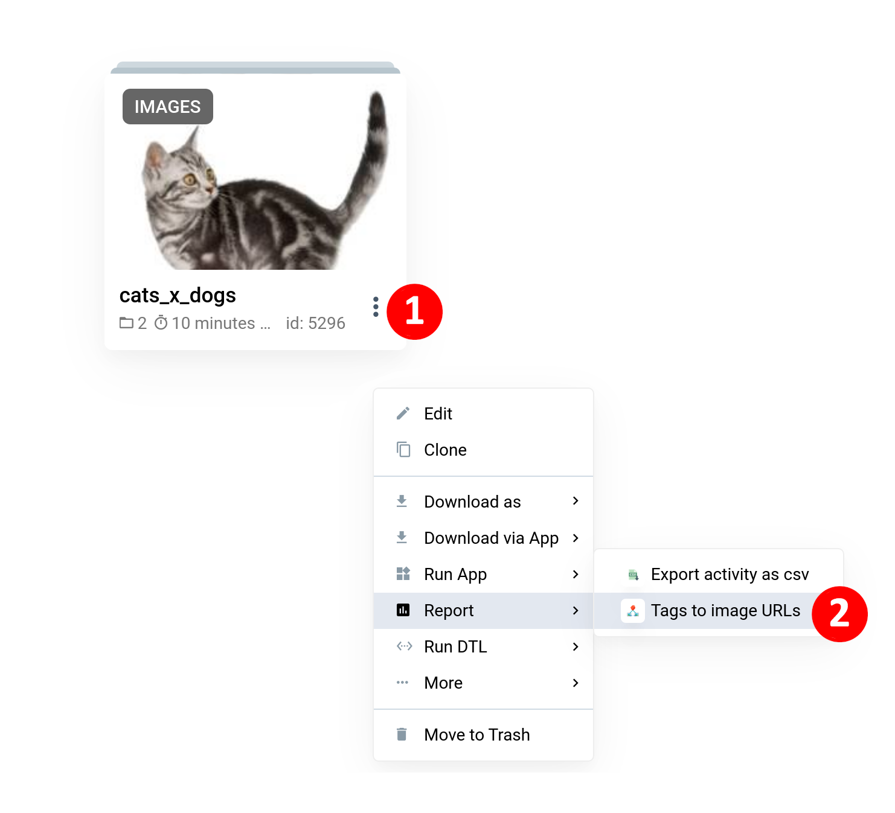
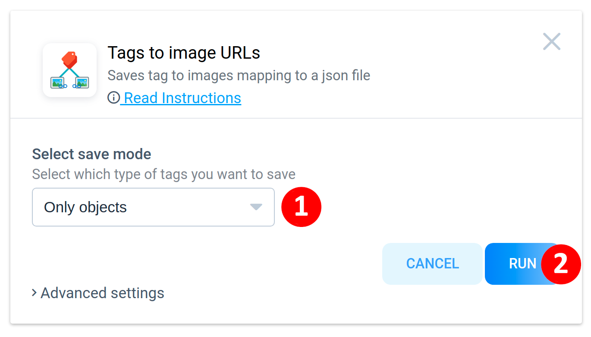
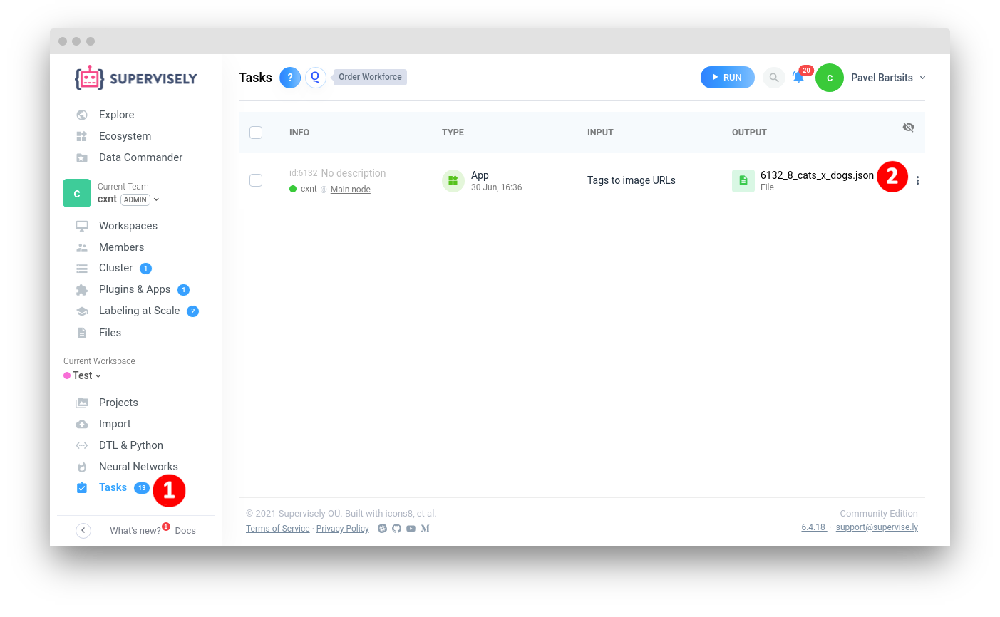
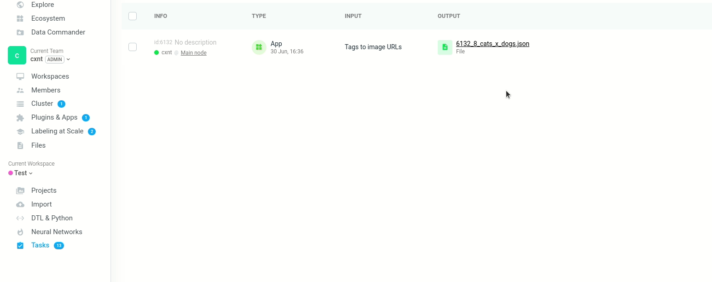

<div align="center" markdown>


# Tags to image URLs

<p align="center">
  <a href="#Overview">Overview</a> •
  <a href="#How-To-Run">How To Run</a> •
  <a href="#How-To-Use">How To Use</a>
</p>

  
[](https://ecosystem.supervise.ly/apps/tags-to-image-urls)
[](https://supervise.ly/slack)

[](https://supervise.ly)
[](https://supervise.ly)

</div>

## Overview

App creates for every tag in project the list of image URLs and saves resulting tag **➜** urls mapping to a JSON file, this app is a part of [classification collection](https://ecosystem.supervise.ly/collections).

**Example `.json` file:**

```json
{
    "cat": [
        "https://app.supervise.ly/...png",
        "https://app.supervise.ly/...png"
    ],
    "dog": [
         "https://app.supervise.ly/...png",
         "https://app.supervise.ly/...png",
    ]
}
```


## How To Run 
**Step 1**: Add app to your team from [Ecosystem](https://ecosystem.supervise.ly/apps/tags-to-image-urls) if it is not there.

**Step 2**: Open context menu of images project -> `Report` -> `Tags to image URLs` 



## How to use

In the modal window select which type of tags you want to save and click `RUN` button.



After running the application, you will be redirected to the `Tasks` page. Once application processing has finished, your file will be available for downloading. 
Click on the `file name` to open file folder.

Your file will placed to the following path: `Team Files`->`tags_to_urls`->`<taskId>_<TeamId>_<projectName>.json`. 



In the file folder simply right click on the file name and choose `Download` option to download it.


